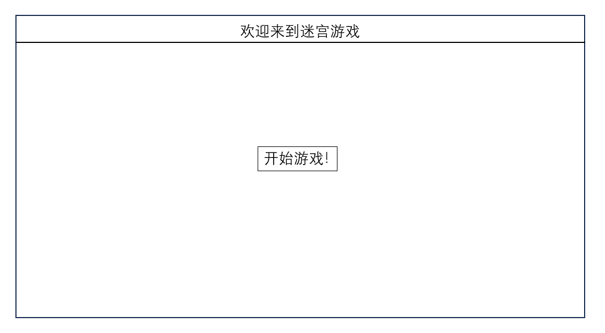
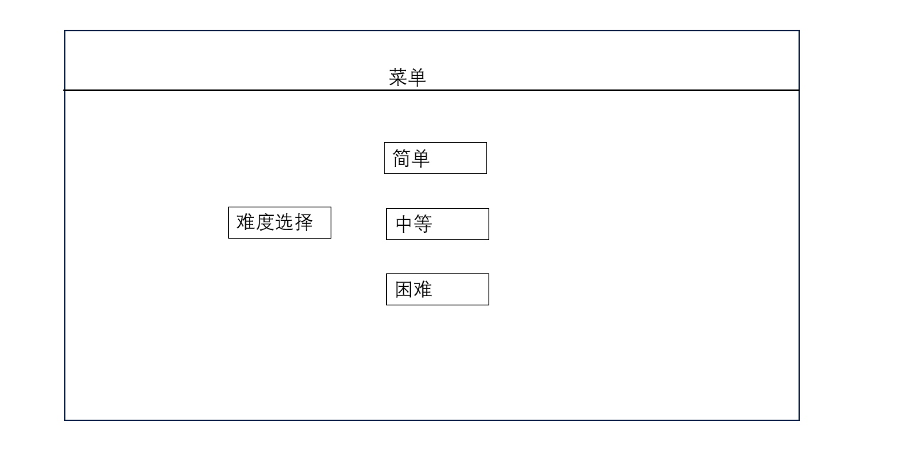
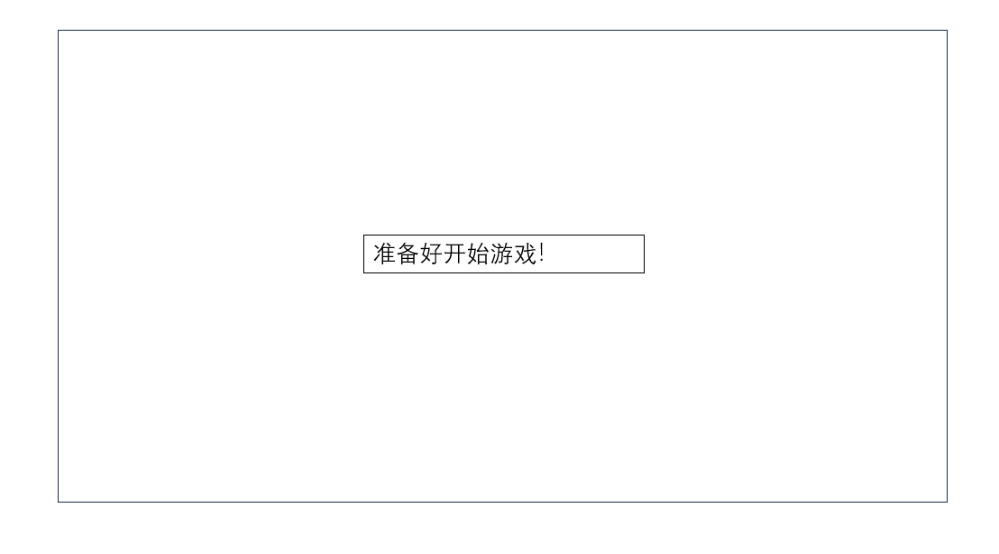
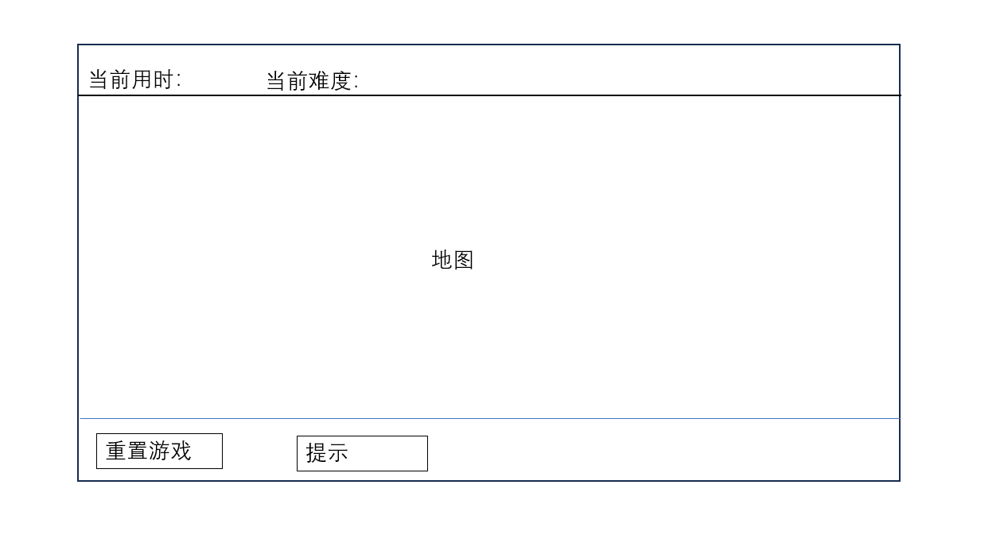
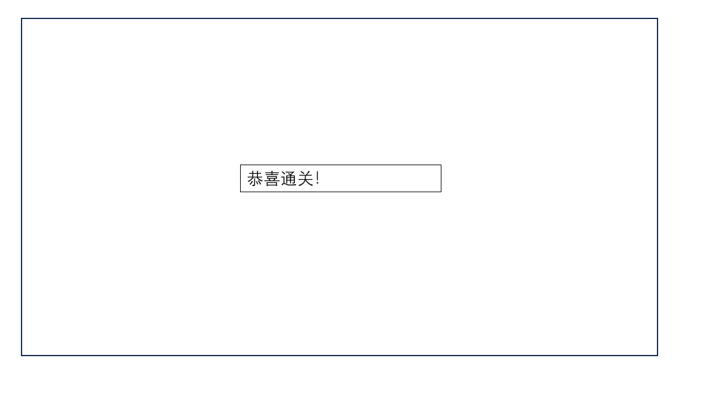

# CST206

*基于JavaFx开发的迷宫游戏,实现了最基本功能*

---

## 1. 代码架构

游戏基于**MVC设计模式**并引入**Service层** 处理游戏中涉及的**相关逻辑**，以保证各层之间**高内聚和低耦合**

**M(游戏模型层):** 存储游戏中涉及的类对象

**V(游戏视图层):** 通过GUI库**JavaFx**给用户提供交互页面

**C(交换控制层):** 通过**JavaFx**中的事件响应功能与后端进行交互

**S(逻辑处理层):** 处理游戏中涉及碰撞移动等功能

通过面向接口编程，使得代码具有更高的灵活性和可维护性。

--- 
## **2. Model层设计**

### 2.1 GameModel

游戏的 **Model层** 是基于 **组合模式** 来设计的，由一个 **IGameModel** 类型来组合一组相似的对象

**接口设计**
```java
public interface IGameModel {
    IPlayerModel getPlayModel();
    IMazeModel getMazeModel();
}
```

**具体实现类**
```java
public class GameModel implements IGameModel {
    //组合各个subModel
    private IPlayerModel playerModel;
    private IMazeModel mazeModel;

    public GameModel(){
        this.mazeModel=new MazeModel(60,60);//先初始化为60,60
        this.playerModel=new PlayerModel(mazeModel);
    }
    //获取playerModel和MazeModel
    @Override
    public IPlayerModel getPlayModel() {
        return playerModel;
    }
    @Override
    public IMazeModel getMazeModel() {
        return mazeModel;
    }
}
```

### 2.2 GameObject

定义了游戏中所有**游戏对象的抽象父类GameObject**, 抽象出游戏对象都应该有的基本属性.

**具体实现**
```java
/*
游戏中所有对象的超类
规定了所有的游戏对象都应该有的属性：
1.横坐标：x
2.纵坐标：y
---
规定了所有游戏对象都应该有的方法：
1.get和set方法
 */
public abstract class GameObject {
  protected int x;
  protected int y;
  //构造函数
  public GameObject(int x, int y) {
    this.x = x;
    this.y = y;
  }

  //相关get和set方法
  public int getX() {
    return x;
  }

  public void setX(int x) {
    this.x = x;
  }

  public int getY() {
    return y;
  }

  public void setY(int y) {
    this.y = y;
  }
}


```

### 2.3 PlayerModel

**Player**

**接口设计**
```java
/*
PlayerModel的接口
规定了PlayModel应特有的方法：
1.move：用于改变对象的坐标
2.setPosition：用于设置对象的坐标
3.获取起始位置的get方法
 */
public interface IPlayerModel {
    int getStartX();
    int getStartY();
    void move(int dx,int dy);
    void setPosition(int x,int y);
    //获取当前位置
    int getX();
    int getY();
}

```

**具体实现**
```java
public class PlayerModel extends GameObject implements IPlayerModel {
  private int startX;
  private int startY;

  public PlayerModel(IMazeModel mazeModel) {
    super(mazeModel.getStartX(), mazeModel.getStartY());
    this.startX = mazeModel.getStartX();
    this.startY = mazeModel.getStartY();
  }

  @Override
  public int getStartX() {
    return startX;
  }

  @Override
  public int getStartY() {
    return startY;
  }

  @Override
  public void move(int dx, int dy) {
    x += dx;
    y += dy;
  }

  @Override
  public void setPosition(int x, int y) {
    setX(x);
    setY(y);
  }
}

```
### 2.4 Maze类

**迷宫类**需要被绘制在界面并且不可移动

这里我们使用一个二维数组来表示这个迷宫并设计可以通过前端的来选择这个迷宫类的行数和列数。

**接口设计**
```java
/*
MazeModel的接口
规定了MazeModel应实现的方法：
1.Rows的get和set方法
2.Cols的get和set方法
3.GoalX和GoalY的get和set方法
4.generateMaze：用来生成迷宫的方法
5.Maze的set和get方法：Maze是用来表示迷宫的一个二维数组，0表示通路，1表示墙壁
 */
public interface IMazeModel {
  int getRows();
  int getCols();
  int getGoalX();
  int getGoalY();
  int getStartX();
  int getStartY();
  int[][] getMaze();
  void setRows(int rows);
  void setCols(int cols);
  void generateMaze();
}
```
这里我们是使用的 **随机化prim生成树算法**来生成迷宫

**具体实现**
```java
/*
迷宫对象的具体实现类
属性：
rows：表示行数
cols：表示列数
maze：用一个二维数组来表示迷宫,[y][x]
goal:目标位置
start：起始位置
 */
public class MazeModel extends GameObject implements IMazeModel {
    private int rows;
    private int cols;
    private int[][] maze;
    private int goalX;
    private int goalY;
    private int startX;
    private int startY;

    // 定义边的类
    private static class Edge {
        int x1, y1, x2, y2;

        Edge(int x1, int y1, int x2, int y2) {
            this.x1 = x1;
            this.y1 = y1;
            this.x2 = x2;
            this.y2 = y2;
        }
    }

    public MazeModel(int rows, int cols) {
        super(0, 0);
        this.rows = rows;
        this.cols = cols;
        this.startX = 1;
        this.startY = 1;
        this.maze = new int[rows][cols];
    }

    /*基于随机prim算法的迷宫生成
        1.先将用于表示迷宫的二维数组全部初始化为1
        2.将入口位置设置为0
        3.初始化一个邻接边的列表用来存储候选边
        4.从当前位置开始添加候选边
        5.在候选边列表中随机选择通路
        6.循环选择通路直至列表为空
         */
    public void generateMaze() {
        this.goalX = cols - 1; // 初始化的迷宫终点坐标（cols-1，rows-2）
        this.goalY = rows - 2;
        Random random = new Random();
        for (int y = 0; y < maze.length; y++) {
            for (int x = 0; x < maze[0].length; x++) {
                maze[y][x] = 1; // 初始化迷宫的二维数组为1（墙）
            }
        }
        maze[startY][startX] = 0; // 设置入口
        //初始化一个边的列表 ，用于储存候选通路
        List<Edge> edges = new ArrayList<>();
        //初始化候选通路
        addEdges(startX, startY, edges);

        //循环处理候选通路，直至生成到终点的通路
        while (!edges.isEmpty()) {
            // 随机选择一个边并移除
            Edge edge = edges.remove(random.nextInt(edges.size()));//在候选边中随机选择一条边来生成通路
            //如果该位置是墙则表示没访问过
            if (maze[edge.x2][edge.y2] == 1) {
                //设置一条通路
                maze[edge.x1][edge.y1] = 0;
                maze[edge.x2][edge.y2] = 0;
                //添加新的候选边
                addEdges(edge.x2, edge.y2, edges);
            }
        }
        maze[goalY][goalX] = 0; // 设置出口

        // 打印迷宫结构
        System.out.println("Maze structure:");
        for (int row = 0; row < rows; row++) {
            for (int col = 0; col < cols; col++) {
                System.out.print(maze[row][col] + " ");
            }
            System.out.println();
        }
    }

    //用于添加候选边的方法
    private void addEdges(int x, int y, List<Edge> edges) {
        // 限制边际，确保添加的候选边不会越界
        if (x > 1 && maze[x - 2][y] == 1) edges.add(new Edge(x - 1, y, x - 2, y));
        if (y > 1 && maze[x][y - 2] == 1) edges.add(new Edge(x, y - 1, x, y - 2));
        if (x < rows - 2 && maze[x + 2][y] == 1) edges.add(new Edge(x + 1, y, x + 2, y));
        if (y < cols - 2 && maze[x][y + 2] == 1) edges.add(new Edge(x, y + 1, x, y + 2));
    }
  //相关的set和get方法
}
```
---
## 3. Service层设计

**Service层** 用于处理游戏相关逻辑的判断与处理，在迷宫游戏中需要判断**Controller层**传入的请求并对**Model层**进行操作

### 3.1 GameService

**GameService** 同样是基于 **组合模式** 来设计的，用来组合 **Service层** 的其他接口

**接口设计**
```java
public interface IGameService {
  void setDifficulty(Difficulty difficulty);
  void resetGame();
  boolean movePlayer(Direction direction);
  IPlayerService getPlayerService();
  IMazeService getMazeService();
  //用来获得路径提示
  List<int[]> getHint();
  //用于依赖注入的方法
  void setGameController(IGameController gameController);
}
```
**具体实现类**
```java
public class GameService implements IGameService {
    IGameModel gameModel;
    IMazeService mazeService;
    IPlayerService playerService;
    IGameController gameController;

    public GameService(IGameModel gameModel) {
        this.gameModel = gameModel;
        mazeService = new MazeService(gameModel.getMazeModel());
        playerService = new PlayerService(mazeService, gameModel.getPlayModel());
    }

    @Override
    public void setDifficulty(Difficulty difficulty) {
        gameModel.getMazeModel().setRows(difficulty.getMazeSize());
        gameModel.getMazeModel().setCols(difficulty.getMazeSize());
    }

    @Override
    public void resetGame() {
        playerService.reset();
        mazeService.reset();
    }

    @Override
    public boolean movePlayer(Direction direction) {
        return playerService.movePlayer(direction.getDirectionX(), direction.getDirectionY());
    }

    @Override
    public IMazeService getMazeService() {
        return mazeService;
    }
    

    @Override
    public List<int[]> getHint() {
        return getPath(mazeService.getMaze().getGoalX(), mazeService.getMaze().getGoalY());
    }

    @Override
    public void setGameController(IGameController gameController) {
        this.gameController = gameController;
    }

    @Override
    public IPlayerService getPlayerService() {
        return playerService;
    }
}
```

### 3.2 MazeService
**MazeService类**用于处理与**Maze**类相关的逻辑
**包括**
1.检测玩家是否碰壁
2.是否在边界内以及是否到达终点。
3.获得路径提示

**接口设计**
```java
/*
用于处理地图相关的逻辑
 */
public interface IMazeService {
    //检查玩家是否走的是通路
    public boolean isValidMove(IPlayerModel player, int dx, int dy);
    //检查玩家是否在迷宫边界内
    public boolean isWithinBounds(int x, int y);
    //检查当前位置是否是墙
    public boolean isPath(int X,int Y);
    //检查玩家是否通关
    public boolean hasReachedGoal(IPlayerModel player);
    //重置迷宫
    public void reset();
    IMazeModel getMaze();
    //提示路线
    public List<int[]> getPath(int x, int y);
}
```

**具体实现类**

这里我们使用DFS算法来实现寻路的算法逻辑

```java
public class MazeService implements IMazeService {
  private IMazeModel maze;

  // 使用依赖注入的方法构造
  public MazeService(IMazeModel mazeModel) {
    this.maze = mazeModel;
  }

  /*
  使用DFS算法来提示迷宫路线
   */
  @Override
  public List<int[]> getPath(int x, int y) {
        /*
        path.get(i)[0]:纵坐标
        path.get(i)[1]:横坐标
         */
    List<int[]> path = new ArrayList<>();
    boolean[][] visited = new boolean[getMaze().getRows()][getMaze().getCols()];
    int startX = getMaze().getStartX();
    int startY = getMaze().getStartY();
    if (dfs(path, visited, startX, startY)) {
      path.add(new int[]{getMaze().getGoalX(), getMaze().getGoalY()});
    }
    return path;
  }

  private boolean dfs(List<int[]> path, boolean[][] visited, int x, int y) {
    // 如果越界或已经访问过或是墙，则返回 false
    if (x < 0 || x >= getMaze().getCols() || y < 0 || y >= getMaze().getRows() || visited[y][x] || getMaze().getMaze()[y][x] == 1) {
      return false;
    }

    // 标记为已访问
    visited[y][x] = true;

    // 添加当前点到路径
    path.add(new int[]{y, x});

    // 如果到达目标点，则返回 true
    if (x == getMaze().getGoalX() && y == getMaze().getGoalY()) {
      return true;
    }

    // 尝试四个方向的递归调用
    if (dfs(path, visited, x - 1, y) || dfs(path, visited, x + 1, y) || dfs(path, visited, x, y - 1) || dfs(path, visited, x, y + 1)) {
      return true;
    }

    // 如果没有找到路径，回溯并从路径中移除当前点
    path.remove(path.size() - 1);
    return false;
  }
  @Override
  public boolean isValidMove(IPlayerModel player, int dx, int dy) {
    //获取新的坐标
    int newX=(int) (player.getX()+dx);
    int newY=(int) (player.getY()+dy);

    // 检查新的坐标是否在边界内以及是否是通路
    boolean isInBounds = isWithinBounds(newX, newY);
    if (isInBounds) {
      System.out.println("Maze cell value at (" + newX + ", " + newY + "): " + maze.getMaze()[newY][newX]);
    }
    boolean isInMaze = isInBounds && isPath(newX,newY);

    // 调试信息
    System.out.println("Checking move to: (" + newX + ", " + newY + "), isInBounds: " + isInBounds + ", isInMaze: " + isInMaze);
    System.out.println(maze.getRows()+" "+maze.getCols());
    return isInBounds && isInMaze;
  }

  @Override
  public boolean isPath(int x, int y) {
    return maze.getMaze()[y][x] == 0;
  }

  @Override
  public boolean isWithinBounds(int x, int y) {
    return x >= 0 && x < maze.getCols() && y >= 0 && y < maze.getRows();
  }

  @Override
  public boolean hasReachedGoal(IPlayerModel player) {
    return player.getX() == maze.getGoalX() && player.getY() == maze.getGoalY();
  }

  @Override
  public void reset() {
    maze.generateMaze();
  }

  @Override
  public IMazeModel getMaze() {
    return maze;
  }
}
```

### 3.3 PlayerService

**PlayerService** 类用于处理与玩家相关的逻辑，包括移动玩家并检查是否到达终点。

**接口设计**
```java
public interface IPlayerService {
    //检查移动是否有效
    public boolean movePlayer(int dx, int dy);
    //检查是否通关
    public boolean checkGoal();
    //获取Player对象实例
    public IPlayerModel getPlayer();
    //重置玩家位置
    public void reset();
    //获取地图实例
    IMazeModel getMaze();
}
```

**具体实现**
```java
public class PlayerService implements IPlayerService {
  private IPlayerModel player;
  private IMazeService mazeService;

  // 依赖注入
  public PlayerService(IMazeService maze, IPlayerModel playerModel) {
    this.player = playerModel;
    this.mazeService = maze;
  }

  @Override
  public boolean movePlayer(int dx, int dy) {
    if (mazeService.isValidMove(player, dx, dy)) {
      player.move(dx, dy);
      System.out.println("X: " + player.getX() + " Y: " + player.getY());
      return checkGoal(); // 返回是否到达终点
    }
    return false; // 移动无效
  }

  @Override
  public boolean checkGoal() {
    return mazeService.hasReachedGoal(player);
  }

  @Override
  public IPlayerModel getPlayer() {
    return player;
  }

  @Override
  public void reset() {
    player.setPosition(player.getStartX(), player.getStartY());
  }

  @Override
  public IMazeModel getMaze() {
    return mazeService.getMaze();
  }
}
```
---

## 4. Controller层设计

**Controller层**用于与处理前端**View层** 发起的请求，返回后端**Service层**的响应

**接口设计**
```java
package com.edu.xmum.cst206.Controller;

/*
Control层用于接收View层的请求并与通过Service层处理相关逻辑

GameController是Control层的主类
包含：
View层的主类gameView
Service层的主类gameService

用于处理前端交互的请求并将后端的响应返回
*/

import com.edu.xmum.cst206.Service.Interface.IGameService;
import com.edu.xmum.cst206.View.Interface.IGameView;

public interface IGameController {
    void startGame();
    void resetGame();
    void setDifficulty(String difficulty);
    void handleKeyPress(String key);
    void showSelectionView();
    void showPrepareView();
    void showRunView();
    void showVictoryView();
    void showHint();
    void setGameView(IGameView gameView);
    String getDiffculty();
    IGameService getGameService();
}
```

**具体实现**

这里为了解决依赖的问题，我们选择使用setter注入的方法。

```java
public class GameController implements IGameController {
    private IGameService gameService;
    private IGameView gameView;
    private Difficulty diff;
    public GameController(IGameService gameService) {
        this.gameService = gameService;
    }
    /*
    改用setter注入，
    private void setupEventHandlers() {
        if (gameView == null) {
            throw new NullPointerException("gameView is null in setupEventHandlers");
        }
        gameView.getWelcomeView().getStartButton().setOnAction(event -> showSelectionView());
        gameView.getSelectionView().getEasyButton().setOnAction(event -> setDifficulty("Easy"));
        gameView.getSelectionView().getMediumButton().setOnAction(event -> setDifficulty("Medium"));
        gameView.getSelectionView().getHardButton().setOnAction(event -> setDifficulty("Hard"));
        gameView.getPrepareView().getStartGameButton().setOnAction(event -> startGame());
        gameView.getRunView().getResetButton().setOnAction(event -> resetGame());
        gameView.getRunView().getHintButton().setOnAction(event -> showHint());

        gameView.getRunView().getNode().setOnKeyPressed(event -> {
            handleKeyPress(event.getText());
        });
    }
     */
    /*
    private void handleVictory() {
        System.out.println("Victory!");
        gameView.showVictoryView();
    }
    */
    @Override
    public void startGame() {
        gameService.resetGame();
        showRunView();
    }

    @Override
    public void resetGame() {
        // 重置玩家和迷宫的状态
        gameService.resetGame();
        //调整尺寸并重新绘图
        gameView.getRunView().adjustLayout();
    }

    @Override
    public void setDifficulty(String difficulty) {
        switch (difficulty.toUpperCase()) {
            case "EASY":
                diff = Difficulty.EASY;
                break;
            case "MEDIUM":
                diff = MEDIUM;
                break;
            case "HARD":
                diff = Difficulty.HARD;
                break;
            default:
                throw new IllegalArgumentException("Unknown difficulty: " + difficulty);
        }
        //调整尺寸，设计定难度
        gameService.setDifficulty(diff);
        showPrepareView();
    }
    public String getDiffculty(){
        switch (diff){
            case EASY -> {
                return "Easy";
            }
            case MEDIUM -> {
                return "Medium";
            }
            case HARD -> {
                return "HARD";
            }
        }
        return null;
    }
    private void adjustCellSize() {
        double cellWidth = Config.SCENE_WIDTH / gameService.getMazeService().getMaze().getCols();
        double cellLength = Config.SCENE_HEIGHT / gameService.getMazeService().getMaze().getRows();
        int cellSize = (int) Math.min(cellLength, cellWidth);
        gameView.getRunView().getPlayerView().setCellSize(cellSize);
        gameView.getRunView().getMazeView().setCellSize(cellSize);
    }

    @Override
    public void handleKeyPress(String key) {
        Direction direction;
        switch (key.toUpperCase()) {
            case "W":
                direction = Direction.UP;
                break;
            case "A":
                direction = Direction.LEFT;
                break;
            case "S":
                direction = Direction.DOWN;
                break;
            case "D":
                direction = Direction.RIGHT;
                break;
            default:
                throw new IllegalArgumentException("Unknown key: " + key);
        }
        boolean reachedGoal = movePlayer(direction);
        if (reachedGoal) {
            showVictoryView();
        }
    }

    private boolean movePlayer(Direction direction) {
        boolean hasWon = gameService.movePlayer(direction);
        gameView.getRunView().getPlayerView().draw();
        return hasWon;
    }

    @Override
    public void showSelectionView() {
        gameView.setSelectionView(new SelectionViewNew());
        gameView.getSelectionView().getEasyButton().setOnAction(event -> setDifficulty("Easy"));
        gameView.getSelectionView().getMediumButton().setOnAction(event -> setDifficulty("Medium"));
        gameView.getSelectionView().getHardButton().setOnAction(event -> setDifficulty("Hard"));
        gameView.showSelectionView();
    }

    @Override
    public void showPrepareView() {
        gameView.setPrepareView(new PrepareViewNew());
        gameView.getPrepareView().getStartGameButton().setOnAction(event -> startGame());
        gameView.showPrepareView();
    }

    @Override
    public void showRunView() {
        gameView.setRunView(new RunView(this));
        adjustCellSize();
        gameView.getRunView().reSetView();
        gameView.getRunView().getResetButton().setOnAction(event -> resetGame());
        gameView.getRunView().getHintButton().setOnAction(event -> showHint());
        gameView.getRunView().getNode().setOnKeyPressed(event -> {
            handleKeyPress(event.getText());
        });
        gameView.showRunView();
    }

    @Override
    public void showVictoryView() {
        gameView.setVictoryView(new VictoryViewNew());
        gameView.showVictoryView();
    }

    @Override
    public void showHint() {
        // 提示功能可以在这里实现
        gameView.getRunView().showHint(gameService.getHint());
    }

    @Override
    public void setGameView(IGameView gameView) {
        this.gameView = gameView;
        gameView.getWelcomeView().getStartButton().setOnAction(event -> showSelectionView());
        //setupEventHandlers();
    }

    public IGameService getGameService() {
        return gameService;
    }

    public IGameView getGameView() {
        return gameView;
    }
}
```

---

## 5. View层设计

**View层**用于负责前端页面的绘制和页面之间的切换，与**Control层进行交互**

### 5.1 GameView

**GameView**同样是基于 **组合模式** 设计的

**GameView** 是**View层** 的聚合父类用于封装**View层**的所有子类并负责页面的切换事件处理

**接口设计**
```java
public interface IGameView {

    void setGameController(IGameController gameController);
    IWelcomeView getWelcomeView();

    ISelectionView getSelectionView();

    IPrepareView getPrepareView();

    IRunView getRunView();

    BorderPane getView();

    void showVictoryView();

    void showSelectionView();

    void showPrepareView();

    void showRunView();
    public void setWelcomeView(IWelcomeView welcomeView) ;

    public void setSelectionView(ISelectionView selectionView);

    public void setPrepareView(IPrepareView prepareView);

    public void setRunView(IRunView runView);

    public void setVictoryView(IVictoryView victoryView);

}
```

**具体实现**

这里初始化选择使用setter注入的方法

```java
public class GameView extends BorderPane implements IGameView {
    IWelcomeView welcomeView;
    ISelectionView selectionView;
    IPrepareView prepareView;
    IRunView runView;
    IVictoryView victoryView;
    IGameController gameController;

    public GameView(IGameController gameController) {
        this.gameController = gameController;
        welcomeView = new WelcomeViewNew();
        /*
        selectionView = new SelectionView();
        prepareView = new PrepareView();
        runView = new RunView(gameController);
        victoryView = new VictoryView();
         */
        setCenter(welcomeView.getNode());
    }

    @Override
    public void setGameController(IGameController gameController) {
        this.gameController = gameController;
    }

    @Override
    public IWelcomeView getWelcomeView() {
        return welcomeView;
    }

    @Override
    public ISelectionView getSelectionView() {
        return selectionView;
    }

    @Override
    public IPrepareView getPrepareView() {
        return prepareView;
    }

    @Override
    public IRunView getRunView() {
        return runView;
    }

    @Override
    public BorderPane getView() {
        return this;
    }

    @Override
    public void showVictoryView() {
        setCenter(victoryView.getNode());
    }

    @Override
    public void showSelectionView() {
        setCenter(selectionView.getNode());
    }

    @Override
    public void showPrepareView() {
        setCenter(prepareView.getNode());
    }

    @Override
    public void showRunView() {
        setCenter(runView.getNode());
    }
    //set注入

    public void setWelcomeView(IWelcomeView welcomeView) {
        this.welcomeView = welcomeView;
    }

    public void setSelectionView(ISelectionView selectionView) {
        this.selectionView = selectionView;
    }

    public void setPrepareView(IPrepareView prepareView) {
        this.prepareView = prepareView;
    }

    public void setRunView(IRunView runView) {
        this.runView = runView;
    }

    public void setVictoryView(IVictoryView victoryView) {
        this.victoryView = victoryView;
    }
}

```

### 5.2 WelcomeView

**WelcomeView** 负责绘制游戏的初始进入页面,使用**VBox**作为布局容器自上而下的布局。



**接口设计**
```java
public interface IWelcomeView {
  Button getStartButton();
  VBox getNode();
}
```

**具体实现**

```java
public class WelcomeViewNew extends VBox implements IWelcomeView {
  private final Button startButton = new Button("开始游戏");

  public WelcomeViewNew() {
    // 设置对齐方式和间距
    setAlignment(Pos.CENTER);
    setSpacing(20);
    setPadding(new Insets(40));

    // 设置背景颜色
    setBackground(new Background(new BackgroundFill(Color.LIGHTBLUE, CornerRadii.EMPTY, Insets.EMPTY)));

    // 添加标题
    Label titleLabel = new Label("欢迎来到迷宫游戏");
    titleLabel.setFont(Font.font("Arial", FontWeight.BOLD, 36));
    titleLabel.setTextAlignment(TextAlignment.CENTER);
    titleLabel.setTextFill(Color.DARKBLUE);

    // 美化开始按钮
    startButton.setFont(Font.font("Arial", FontWeight.BOLD, 24));
    startButton.setTextFill(Color.WHITE);
    startButton.setStyle("-fx-background-color: #FF6347; -fx-background-radius: 10;");

    // 鼠标悬停样式
    startButton.setOnMouseEntered(e -> startButton.setStyle("-fx-background-color: #FF4500; -fx-background-radius: 10;"));
    startButton.setOnMouseExited(e -> startButton.setStyle("-fx-background-color: #FF6347; -fx-background-radius: 10;"));

    // 添加组件到VBox
    getChildren().addAll(titleLabel, startButton);
  }

  @Override
  public Button getStartButton() {
    return startButton;
  }

  @Override
  public VBox getNode() {
    return this;
  }
}
```
### 5.3 SelectionView

**SelectionView** 负责绘制游戏的难度页面，使用**VBox**作为布局容器自上而下的布局。



**接口设计**
```java
public interface ISelectionView {
    Button getEasyButton();

    Button getMediumButton();

    Button getHardButton();
    VBox getNode();
}
```

**具体实现**
```java
public class SelectionViewNew extends VBox implements ISelectionView {
  private Button easyButton = new Button("Easy");
  private Button mediumButton = new Button("Medium");
  private Button hardButton = new Button("Hard");

  public SelectionViewNew() {
    super();
    setAlignment(Pos.CENTER);
    setSpacing(20);
    setPadding(new Insets(40));

    // 设置背景颜色
    setBackground(new Background(new BackgroundFill(Color.LIGHTBLUE, CornerRadii.EMPTY, Insets.EMPTY)));

    // 添加标题
    Label difficultyLabel = new Label("选择难度");
    difficultyLabel.setFont(Font.font("Arial", FontWeight.BOLD, 24));
    difficultyLabel.setTextFill(Color.DARKBLUE);

    // 美化按钮
    styleButton(easyButton, "#32CD32", "#228B22");
    styleButton(mediumButton, "#FFA500", "#FF8C00");
    styleButton(hardButton, "#FF6347", "#FF4500");

    // 添加组件到VBox
    getChildren().addAll(difficultyLabel, easyButton, mediumButton, hardButton);
  }

  private void styleButton(Button button, String bgColor, String hoverColor) {
    button.setFont(Font.font("Arial", FontWeight.BOLD, 18));
    button.setTextFill(Color.WHITE);
    button.setStyle("-fx-background-color: " + bgColor + "; -fx-background-radius: 10;");
    button.setOnMouseEntered(e -> button.setStyle("-fx-background-color: " + hoverColor + "; -fx-background-radius: 10;"));
    button.setOnMouseExited(e -> button.setStyle("-fx-background-color: " + bgColor + "; -fx-background-radius: 10;"));
  }

  @Override
  public Button getEasyButton() {
    return easyButton;
  }

  @Override
  public Button getMediumButton() {
    return mediumButton;
  }

  @Override
  public Button getHardButton() {
    return hardButton;
  }

  @Override
  public VBox getNode() {
    return this;
  }
}
```
### 5.4 PrepareView

**PrepareView** 负责游戏准备页面的设计，使用**VBox**作为布局容器自上而下的布局。

**接口设计**
```java
public interface IPrepareView {
    Button getStartGameButton();
    VBox getNode();
}
```

**具体实现**
```java
public class PrepareViewNew extends VBox implements IPrepareView {
  private final Button startGameButton = new Button("开始游戏");

  public PrepareViewNew() {
    super();
    setAlignment(Pos.CENTER);
    setSpacing(20);
    setPadding(new Insets(40));

    // 设置背景颜色
    setBackground(new Background(new BackgroundFill(Color.LIGHTBLUE, CornerRadii.EMPTY, Insets.EMPTY)));
    setStyle("-fx-background-color: rgba(71,249,255,0.63); -fx-text-fill: white; -fx-font-size: 14px;");
    // 添加标题
    Label prepareLabel = new Label("准备好开始游戏!");
    prepareLabel.setFont(Font.font("Arial", FontWeight.BOLD, 24));
    prepareLabel.setTextFill(Color.DARKBLUE);

    // 美化开始游戏按钮
    styleButton(startGameButton, "#FF6347", "#FF4500");

    // 添加组件到VBox
    getChildren().addAll(prepareLabel, startGameButton);
  }

  private void styleButton(Button button, String bgColor, String hoverColor) {
    button.setFont(Font.font("Arial", FontWeight.BOLD, 18));
    button.setTextFill(Color.WHITE);
    button.setStyle("-fx-background-color: " + bgColor + "; -fx-background-radius: 10;");
    button.setOnMouseEntered(e -> button.setStyle("-fx-background-color: " + hoverColor + "; -fx-background-radius: 10;"));
    button.setOnMouseExited(e -> button.setStyle("-fx-background-color: " + bgColor + "; -fx-background-radius: 10;"));
  }

  @Override
  public Button getStartGameButton() {
    return startGameButton;
  }

  @Override
  public VBox getNode() {
    return this;
  }
}
```

### 5.5 RunView

**RunView** 负责游戏主页面的绘制,使用 **BoardPane** 作为主控局组件，自上而下的添加组件



**接口设计**
```java
public interface IRunView {
    Button getResetButton();

    Button getHintButton();

    BorderPane getNode();

    IPlayerView getPlayerView();
    IMazeView getMazeView();

    void reSetView();
    public void adjustLayout();
    public void showHint(List<int[]> path);
}
```

**具体实现**
```java
public class RunView extends BorderPane implements IRunView {
    private IPlayerView playerView;
    private IMazeView mazeView;
    private Label currentDifficulty;
    private Button resetButton;
    private Button hintButton;
    private IGameController gameController;

    public RunView(IGameController gameController) {
        // 初始化组件
        this.gameController = gameController;
        currentDifficulty = new Label("难度:"+gameController.getDiffculty());
        mazeView = new MazeViewSimple(gameController.getGameService().getMazeService().getMaze());
        playerView = new PlayerViewSimple(gameController.getGameService().getPlayerService().getPlayer());
        resetButton = new Button("重置游戏");
        hintButton = new Button("提示");

        // 设置按钮样式
        resetButton.setStyle("-fx-background-color: #FF6347; -fx-text-fill: white; -fx-font-size: 14px;");
        hintButton.setStyle("-fx-background-color: #4682B4; -fx-text-fill: white; -fx-font-size: 14px;");
        // 设置字体和颜色
        currentDifficulty.setFont(new Font("Arial", 16));
        //currentDifficulty.setStyle("-fx-background-color: #ff4747; -fx-text-fill: white; -fx-font-size: 14px;");

        // 设置提示信息样式
        HBox infoBox = new HBox(20,  currentDifficulty);
        infoBox.setAlignment(Pos.CENTER);
        infoBox.setPadding(new Insets(10, 10, 10, 10));
        infoBox.setBackground(new Background(new BackgroundFill(Color.LIGHTGRAY, CornerRadii.EMPTY, Insets.EMPTY)));
        infoBox.setStyle("-fx-background-color: #ffa347; -fx-text-fill: white; -fx-font-size: 14px;");
        // 设置控制面板样式
        HBox controlBox = new HBox(20, resetButton, hintButton);
        controlBox.setAlignment(Pos.CENTER);
        controlBox.setPadding(new Insets(10, 10, 10, 10));
        controlBox.setBackground(new Background(new BackgroundFill(Color.LIGHTGRAY, CornerRadii.EMPTY, Insets.EMPTY)));
        controlBox.setStyle("-fx-background-color: #ffa947; -fx-text-fill: white; -fx-font-size: 14px;");
        // 设置游戏面板样式
        StackPane gamePane = new StackPane();
        gamePane.setAlignment(Pos.CENTER);
        gamePane.getChildren().addAll(mazeView.getNode(), playerView.getNode());
        gamePane.setStyle("-fx-background-color: white; -fx-border-color: #A9A9A9; -fx-border-width: 1px;");
        // 控制排版
        setTop(infoBox);
        setCenter(gamePane);
        setBottom(controlBox);

        // 确保游戏面板可以获得焦点
        gamePane.setFocusTraversable(true);
        setOnMouseClicked(event -> requestFocus());

        // 添加监听器调整组件大小
        gamePane.widthProperty().addListener((obs, oldVal, newVal) -> adjustLayout());
        gamePane.heightProperty().addListener((obs, oldVal, newVal) -> adjustLayout());

        // 设置主边框
        setStyle("-fx-background-color: #F5F5F5;");
    }

    @Override
    public Button getResetButton() {
        return resetButton;
    }

    @Override
    public Button getHintButton() {
        return hintButton;
    }

    @Override
    public BorderPane getNode() {
        return this;
    }

    @Override
    public IPlayerView getPlayerView() {
        return playerView;
    }

    @Override
    public IMazeView getMazeView() {
        return mazeView;
    }

    @Override
    public void reSetView() {
        playerView.reDraw();
        mazeView.reDraw();
    }

    @Override
    public void adjustLayout() {
        double cellWidth = getWidth() / gameController.getGameService().getMazeService().getMaze().getCols();
        double cellHeight = (getHeight() - getTop().getLayoutBounds().getHeight() - getBottom().getLayoutBounds().getHeight()) /
                gameController.getGameService().getMazeService().getMaze().getRows();
        int cellSize = (int) Math.min(cellWidth, cellHeight);
        playerView.setCellSize(cellSize);
        mazeView.setCellSize(cellSize);
        reSetView();
        // 居中调整
        double mazeWidth = cellSize * gameController.getGameService().getMazeService().getMaze().getCols();
        double mazeHeight = cellSize * gameController.getGameService().getMazeService().getMaze().getRows();
        double offsetX = (getWidth() - mazeWidth) / 2;
        double offsetY = (getHeight() - ((HBox)getTop()).getHeight() - ((HBox)getBottom()).getHeight() - mazeHeight) / 2;

        mazeView.getNode().setTranslateX(offsetX);
        mazeView.getNode().setTranslateY(offsetY);
        playerView.getNode().setTranslateX(offsetX);
        playerView.getNode().setTranslateY(offsetY);
    }

    /*
    绘制DFS搜索出来的路径
     */
    @Override
    public void showHint(List<int[]> path) {
        int cellSize = mazeView.getCellSize();
        // 清除之前的提示
        mazeView.getNode().getChildren().removeIf(node -> node.getUserData() != null && node.getUserData().equals("highlight"));
        // 动态显示提示路径
        Timeline timeline = new Timeline();
        // 用于存储当前显示的矩形，以便逐步删除
        List<Rectangle> currentRects = new ArrayList<>();

        for (int i = 0; i < path.size(); i++) {
            int[] point = path.get(i);

            // 创建一个新的矩形，用于高亮当前路径点
            Rectangle rect = new Rectangle(point[1] * cellSize, point[0] * cellSize, cellSize, cellSize);
            rect.setFill(Color.GRAY);
            rect.setUserData("highlight");

            // 将绘制和删除操作封装在 KeyFrame 中
            KeyFrame keyFrame = new KeyFrame(Duration.seconds(i * 0.5), event -> {
                // 移除前一个高亮的矩形（如果有）
                if (!currentRects.isEmpty()) {
                    mazeView.getNode().getChildren().remove(currentRects.remove(0));
                }
                // 添加当前高亮的矩形
                mazeView.getNode().getChildren().add(rect);
                currentRects.add(rect);
            });

            timeline.getKeyFrames().add(keyFrame);
        }

        timeline.play();
    }

}

```
### 5.6 VictoryView

**VictoryView** 用来显示游戏胜利的页面，使用 **VBox** 作为主控局容器



**接口设计**
```java
public interface IVictoryView {
        VBox getNode();
}
```
**具体实现**
```java
public class VictoryView extends VBox implements IVictoryView {
  public VictoryView() {
    setAlignment(Pos.CENTER);
    setSpacing(20);
    Label victoryLabel = new Label("恭喜通关!");
    victoryLabel.setFont(new Font(24));
    getChildren().add(victoryLabel);
  }

  @Override
  public VBox getNode() {
    return this;
  }
}

```
---